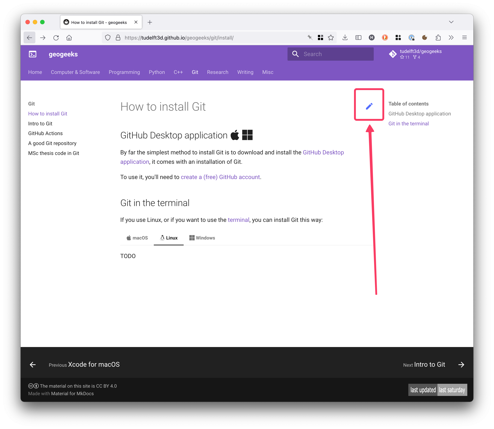

# geogeeks

The place where geogeeks go to know "how to do X".

## To compile locally

1. `pip install mkdocs-material mkdocs-awesome-pages-plugin`
1. (`pip install --upgrade --force-reinstall mkdocs-material` to upgrade to latest version v9+)
1. `mkdocs serve` (when you modify the source of a page, the localhost serve updates automatically)

### if you use uv

1. `uv sync`
1. `uv run mkdocs serve`
