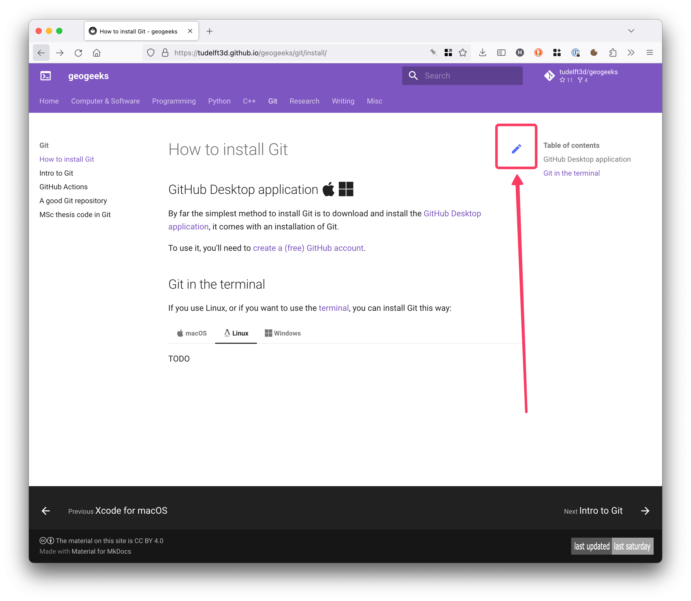

# 

<iframe src="https://giphy.com/embed/l0HlHFRbmaZtBRhXG" width="480" height="270" frameBorder="0" class="giphy-embed" allowFullScreen></iframe>

 

- - -

## List of topics

<https://gist.github.com/hugoledoux/9e3c9e32e14182808c9875c35883ecbd>

## How to fix errors and contribute?

1. Click on the 'Edit this page' 
2. You have to login to GitHub
3. Modify the Markdown text
4. Create a [pull request](https://docs.github.com/en/pull-requests/collaborating-with-pull-requests/proposing-changes-to-your-work-with-pull-requests/creating-a-pull-request)

