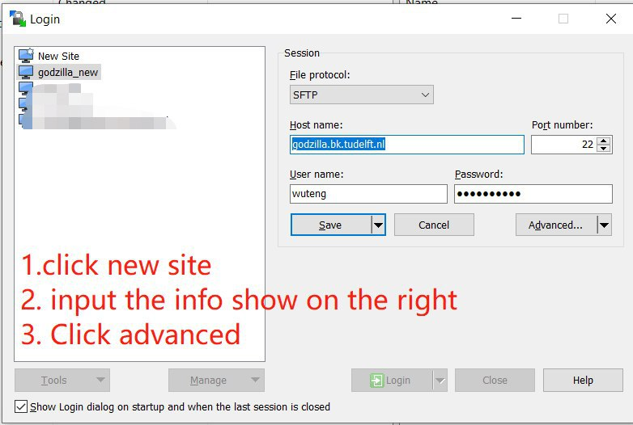
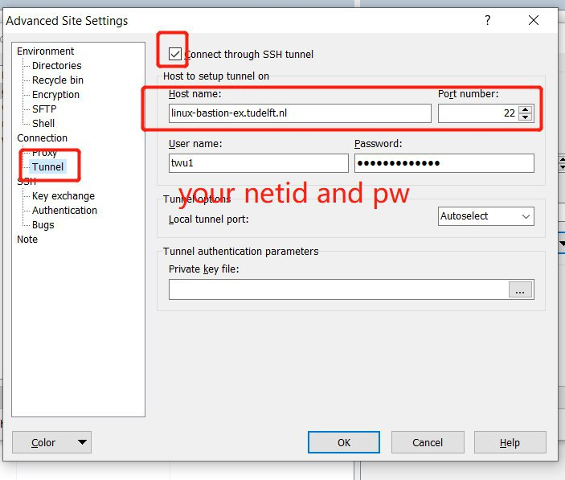

# How to connect to a TU Delft Linux server with ssh

The connection to a TU Delft Linux server is done with SSH through your terminal on Unix-based systems or PowerShell on Windows. On Windows you can also use [PuTTY](https://putty.org/), but the recommended option is [WSL](../linux/wsl.md), which lets you follow the macOS/Linux instructions below.

When working remotely, make sure `eduVPN` is installed and active wherever `eduroam` is unavailable.

## **Step 1: Connect to the jump server**

Direct SSH access to TU Delft servers is not allowed, so you must first connect to a jump server.

!!! warning
    For TU Delft employees the jump server is `linux-bastion-ex.tudelft.nl`; for students it is `student-linux.tudelft.nl`. This guide uses `student-bastion-ex.tudelft.nl` as an example.

Run the following in your terminal or PowerShell, substituting `<netid>` with your NetID and the correct jump server name:

```bash
ssh <netid>@student-bastion-ex.tudelft.nl
```

Enter your NetID password when prompted. If your connection is successful, you will be connected to the jump server.

## **Step 2: Connect from the jump server to the TU Delft server**

Once connected to the jump server, ssh directly to your server. Its hostname should be in the email you received (here we use `gilfoyle.bk.tudelft.nl` as an example).

  Depending on the username you received in the email there are 2 options:

  A) If the username is the same as your NetID, run:
```bash
ssh gilfoyle.bk.tudelft.nl
```

B) If it differs from your NetID, run:

```bash
ssh <username>@gilfoyle.bk.tudelft.nl
```

  When you are prompted for a password, give the temporary password from the email. Then set up your new password.

  Congrats! You have connected to the server!

## **Step 3: Make the connection easier with SSH keys (optional)**

#### 3.1 Create an ssh key
To connect to the server faster and without the need for a password, you need to generate an SSH key pair. In your terminal/PowerShell, type:
```bash
ssh-keygen -t rsa
```
and follow the instructions. The flag `–t rsa` is used to set the algorithm to be used for the key generation and can be substituted with `-t ed25519`, if preferred. It is recommended to use a password to protect your keys. You'll have to use this password every time you login, or you can use ssh-add to store it (once after you restart your computer). This command will create an SSH key pair in your `~/.ssh` directory (on Windows this is `C:\Users\<username>\.ssh`). There will be 2 files, `id_rsa` for the private key and `id_rsa.pub` for the public one. If you choose to name your file differently (to avoid overwriting other ssh keys you might have) please make sure to use the correct file name in the following commands. 

#### 3.2 Create a config file
Create a file named `config` in your `~/.ssh` folder (`C:\Users\<username>\.ssh` on Windows):
=== ":simple-apple: :simple-linux: Unix (macOS & Linux)"

    ```bash
    vim ~/.ssh/config
    ```

=== ":material-microsoft-windows: Windows"

    ```powershell
    notepad $env:USERPROFILE\.ssh\config
    ```
    If the `.ssh` folder does not exist yet, create it first with `mkdir $env:USERPROFILE\.ssh`.
Then add the following content:
```
Host bastionex
Hostname student-bastion-ex.tudelft.nl
User <netid>

Host <server_name>
Hostname <server_hostname>
ProxyJump bastionex
User <username>

```
Replace `<netid>` with your netid. Substitute `<server_hostname>` and `<username>` with your server credentials. Substitute  `<server_name>` with a name you choose for the server. Example for gilfoyle:
```
Host gilfoyle
Hostname gilfoyle.bk.tudelft.nl
ProxyJump bastionex
User <username>

```
For each server that you would like to connect to you can add the same snippet to your config file.
If you changed the key filename from `id_rsa`, add this line to each host:
```
IdentityFile ~/.ssh/<your_filename>
```


#### 3.3 Copy your public key to the jump server and each server

=== ":simple-apple: :simple-linux: Unix (macOS & Linux)"

    ```bash
    ssh-copy-id bastionex
    ```
     And give your NetID password when prompted.

    ```bash
    ssh-copy-id <server>
    ```
    Give your key's passphrase, then the server password

=== ":material-microsoft-windows: Windows"

    ```powershell
    Get-Content C:\<home_directory>\.ssh\id_rsa.pub | ssh bastionex "cat >> .ssh/authorized_keys"
    ```

    Give your TU Delft password when prompted. Repeat for each server, replacing `bastionex` with `<server_name>` and use the server password when prompted

#### 3.4 Usage

Once your `~/.ssh/config` is set and your key is copied, log in with:

`ssh <server_name>`

## **Step 4: Transfer files to and from the server**

You can transfer files over the same SSH connection. With the setup from Step 3 you can use the `<server_name>` alias, which tunnels through the jump server automatically.

=== ":simple-apple: :simple-linux: Unix (macOS & Linux)"

    Copy a local file to the server with `rsync`:

    ```bash
    rsync -avz /path/to/local/folder/myfile.txt <server_name>:/path/on/server/folder/
    ```

    Reverse the paths to download:

    ```bash
    rsync -avz  <server_name>:/path/on/server/folder/ /path/to/local/folder/myfile.txt
    ```


=== ":material-microsoft-windows: Windows"

    Copy a local file to the server:

    ```powershell
    scp C:\path\to\local\file <server_name>:/path/on/server/
    ```

    Copy a file from the server to your computer:

    ```powershell
    scp <server_name>:/path/on/server/file C:\path\to\local\
    ```

    If you prefer using a graphical interface, you can use [WinSCP](https://winscp.net/) and configure a session as shown below.

    
    

