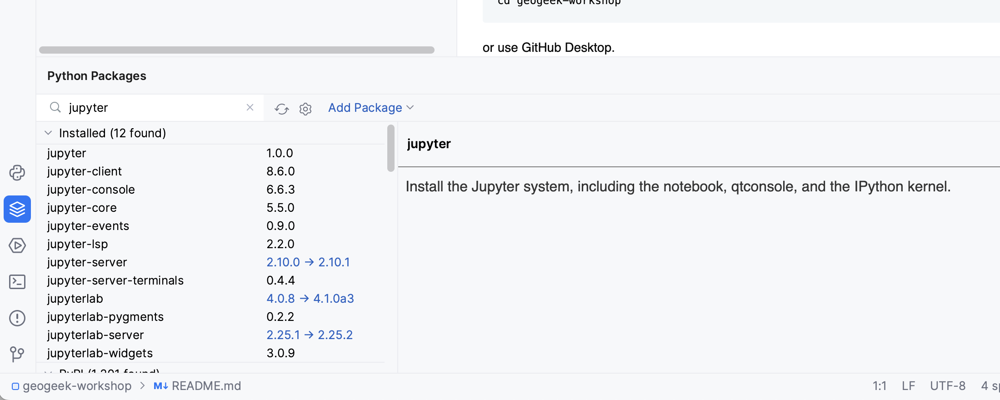
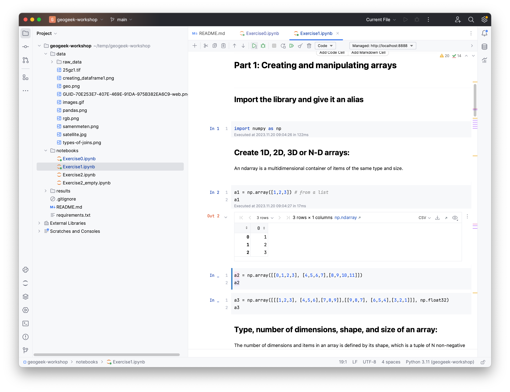

# Jupyter Lab & Notebooks

If you are working with Python, a great way to develop your code efficiently, especially when performing data analysis or creating proof-of-concepts, is to use [Jupyter notebooks](https://jupyter.org/). 
Here we are showing you how to do this through Jupyter lab, which is a web-based, interactive development environment that includes Jupyter notebooks. 


# How to install & launch

=== "Using the terminal"
    
    In your [terminal](../computer/terminal.md), you can use `pip` to install Jupyter Lab packages.

    ```bash
     pip install jupyterlab
    ```

    Then you can launch the application with:

    ```bash
    jupyter lab
    ```

    This will start Jupyter Lab in your internet browser (eg Firefox/Chrome/Safari). 
    On the left panel you can navigate through your files and directories. The right panel is the Launcher; from here you can start a notebook, as shown below. 

    


=== "Using PyCharm"
    
    !!! warning 
        This does **not** not with the free version of PyCharm (Community Edition).
        You need the [Professional Edition](https://www.jetbrains.com/pycharm/) (free for students).

    In PyCharm, open a project where you have one or more `*.ipynb` files and then install "jupyterlab" and "jupyter" packages:

    {:width="500px"}

    and then you can simply run press Run/Play to run the cell that is currently selected, and you can select the one you want with the mouse.

        


## How to work with a notebook

Within the new notebook, you can write small blocks of code in separate cells and run them individually by pressing `SHIFT+ENTER`. You can move cells around and collapse them, plot graphs and images and you can even add [Markdown](../writing/markdown.md) cells to document your process. 


!!! info 
    The biggest advantage of the notebook is that you do not need to rerun parts of code that might be time-consuming (eg loading a large TIF file). Once a cell is run, its state is preserved and subsequent cells can be changed and run independently. 

As shown below, you can use a exclamation mark to run bash commands (for example for installing a new python module to your environment) and a question mark to see some information about you functions an variables. 


