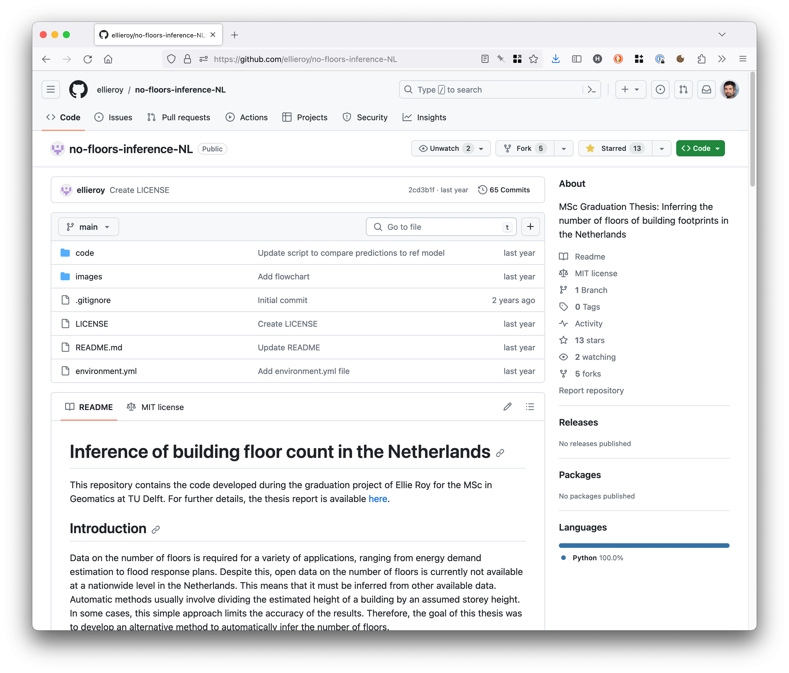

# MSc thesis code in Git

Following the [open science requirements](https://3d.bk.tudelft.nl/courses/geo2020/openscience/), it is now mandatory to release your code as open-source and to document it.

You should first make sure that you have [all the ingredients of a good Git repository](../git/goodgit.md), and then you can have a look at 4 good examples of repositories from MSc students:

[{:width="300px"}](https://github.com/fabisser/stylesdf)
[{:width="300px"}](https://github.com/NoortjevanderHorst/treegrowthmodelling)
[{:width="300px"}](https://github.com/ellieroy/no-floors-inference-NL)
[{:width="300px"}](https://github.com/chenzhaiyu/points2poly)

