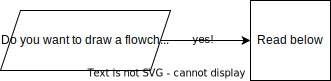

# LaTeX


## LaTeX installation


### Web-application: Overleaf

[](https://overleaf.com)

To start, the geogeek-in-chief recommends you use the [online LaTeX environment Overleaf](https://www.overleaf.com) since it has a full installation of LaTeX and there is nothing to install.
If you login with your TUDelft email, you get extra features (TUDelft pays for it).

### Local installation

If you want to use LaTeX locally (it's faster to compile) then you need either:

  - [MiKTeX](http://miktex.org/about) :material-microsoft-windows:
  - [MacTeX](https://tug.org/mactex) :simple-apple: 
  - [TeXLive](https://www.tug.org/texlive) :simple-linux:

You can also combine the best of both worlds (overleaf and local), by using either the [Git Integration](https://www.overleaf.com/learn/how-to/Git_integration) to treat your Overleaf project as a remote repository or by using [GitHub synchronisation](https://www.overleaf.com/learn/how-to/GitHub_Synchronization) linking your project to a GitHub repository. Check the recommendations for local editors below. 

!!! warning 

    For small documents Overleaf is great. But it becomes rather slow for medium to large documents, and then using LaTeX locally is probably a better idea.

    Beware that pushes from Git/GitHub can result in the loss or displacement of track changes and comments, so make sure you don't mix the two (and make your supervisors aware).


## Getting started

!!! external-link "Overleaf's getting started with LaTeX"

    The best is to follow the [Overleaf's Learn LaTeX in 30min](https://www.overleaf.com/learn/latex/Learn_LaTeX_in_30_minutes) to start.

    The only crucial thing missing from it is how to add references, for this we suggest you use "natbib" ([tutorial about bibliography management with natbib](https://www.overleaf.com/learn/latex/Bibliography_management_with_natbib)).


## Test yourself with an exercise

  1. Register at <https://overleaf.com> with your `@tudelft.nl` email (for an account with more options, TUDelft pays for it)
  1. Start with the template below and discover/try some features. Notice that this won't compile correctly because of the reference on line 26: the file `myreferences.bib` should be in the same folder
  1. copy the content of the second file to a file `myreferences.bib` and add it to the same folder
  1. check this [demo template](https://github.com/tudelft3d/latex-getting-started/tree/main/template) to know the best way to make complex things (tables, code, etc.)
  1. when all this works, try to replicate [this PDF](./files/latex_result.pdf)

[SOLUTION](./files/latex_result.tex)

### A better starting template for simple LaTeX

```tex
\documentclass[a4paper,11pt]{scrartcl}

\usepackage{graphicx}
\usepackage[utf8]{inputenc} %-- pour utiliser des accents en français
\usepackage{amsmath,amssymb,amsthm} 
\usepackage[round]{natbib}
\usepackage{url}
\usepackage{mathpazo}
\usepackage{booktabs}
\usepackage{hyperref}

\title{My great title}
\author{Jan Smit\\ \url{j.smit@tudelft.nl}}
\date{\today}

\begin{document}

\maketitle

\section{Introduction}

Lemongrass frosted gingerbread bites banana bread orange crumbled lentils sweet potato black bean burrito green pepper springtime. 
Strawberry ginger lemongrass agave green tea smoky maple tempeh glaze enchiladas couscous. 
Cranberry spritzer Malaysian cinnamon pineapple salsa apples spring cherry bomb bananas blueberry pops scotch bonnet pepper.

Bento box roasted peanuts pasta Sicilian~\citep{DeVries20}.

\bibliographystyle{abbrvnat}
\bibliography{references.bib}

\end{document}
```

```tex
@article{DeVries20,
  author = {De Vries, Piet},
  doi = {10.1016/j.scs.2022.104225},
  journal = {Sustainable Cities and Society},
  pages = {102222},
  title = {Understanding the relationship between urban morphology and other things},
  year = {2021}
}
```

## Figures

!!! important
    Make sure your figures are **vector** when possible, and __not__ raster. 
    This will make them of greater quality, especially for text.
    
    Vector formats: PDF, SVG.

    Raster formats: PNG, JPG, JPEG, GIF.

    {:width="400px"}

Best vector graphics drawing tools:

  - [Affinity Designer](https://affinity.serif.com/es/designer/full-feature-list/)  :simple-apple: :material-microsoft-windows: (€€ but way less than Adobe)
  - [Inkscape](https://inkscape.org/en/) :material-open-source-initiative: :simple-linux: :simple-apple: :material-microsoft-windows:
  - [IPE](http://ipe.otfried.org/) :material-open-source-initiative: :simple-linux: :simple-apple: :material-microsoft-windows: (integrates LaTeX text; great for triangulation and geometric stuff)
  - Adobe Illustrator :simple-apple: :material-microsoft-windows: (nice, but €€€)


## Tables 

Tables are notoriously difficult to make in LaTeX.

!!! tip 
    [LaTeX package booktabs](https://nhigham.com/2019/11/19/better-latex-tables-with-booktabs/) is strongly recommended!

    ```tex
    The package \texttt{booktabs} permits you to make nicer tables than the basic ones in \LaTeX.
    See for instance \autoref{tab:example}.

    \usepackage{booktabs}
    ...
    \begin{table}
      \centering
      \begin{tabular}{@{}lrrcrrc@{}} \toprule
        & \multicolumn{2}{c}{3D model} && \multicolumn{2}{c}{input} \\
        \cmidrule{2-3}  \cmidrule{5-6} 
        & solids & faces && vertices & constraints  \\ 
        \toprule
        \textbf{campus}  & 370   & 4~298  && 5~970  & 3~976   \\
        \textbf{kvz}     & 637   & 6~549  && 8~951  & 13~571  \\
        \textbf{engelen} & 1~629 & 15~870 && 23~732 & 15~868 \\ 
        \bottomrule
       \end{tabular}
      \caption{Details concerning the datasets used for the experiments.}%
    \label{tab:example}
    \end{table}
    ```


## Flowcharts



  - [draw.io](https://app.diagrams.net) :material-web: (free, simple, all you probably need)
  - [OmniGraffle](https://www.omnigroup.com/omnigraffle) :simple-apple: (nice, but €€€)


## Tips and tricks for LaTeX

:material-download-box-outline: [this simple demo](https://github.com/tudelft3d/latex-getting-started/tree/main/template) gives you tips and tricks to do most of the useful things in LaTeX.

Use it as the template for submitting your homework for instance.

!!! info

    LaTeX is great but there are often 37 ways to accomplish something... The simple demo shows you what we think is "the best to do X".


## Which software to use? 

### Editors (if you don't use Overleaf, or use Git/GitHub to edit your Overleaf project locally)

  - [TeXnicCenter](http://www.texniccenter.org) :material-open-source-initiative: :material-microsoft-windows: 
  - [TeXStudio](https://www.texstudio.org/) :material-open-source-initiative: :simple-linux: :simple-apple: :material-microsoft-windows:
  - [TeXshop](http://pages.uoregon.edu/koch/texshop/) :material-open-source-initiative: :simple-apple: (bundled with MacTeX)
  - [Visual Studio Code](https://code.visualstudio.com/) as generic editor with the [LaTeX Workshop plugin](https://github.com/James-Yu/LaTeX-Workshop) :material-open-source-initiative: :simple-linux: :simple-apple: :material-microsoft-windows:
  - [Texmaker](https://www.xm1math.net/texmaker/) :material-open-source-initiative: :simple-linux: :simple-apple: :material-microsoft-windows:
  - [Sublime Text](https://www.sublimetext.com) :material-open-source-initiative: :simple-linux: :simple-apple: :material-microsoft-windows: (TeX support can be added through [package control](https://packagecontrol.io) with the LaTeXTools package; also with package control you can get a nice linter called SublimeLinter with TeX support through SublimeLinter-chktex)

!!! info
    
    For some of these editors, you can also add local grammar/spell checking, e.g. [LTeX](https://marketplace.visualstudio.com/items?itemName=valentjn.vscode-ltex) for Visual Studio Code or [LanguageTool](https://packagecontrol.io/packages/LanguageTool) for Sublime Text.

### Managing references

  - [JabRef](http://jabref.sourceforge.net) :material-open-source-initiative: :simple-linux: :simple-apple: :material-microsoft-windows:
  - [Zotero](https://www.zotero.org/) :material-open-source-initiative: :simple-linux: :simple-apple: :material-microsoft-windows: :material-web: (integrations for Office and browsers; use a plugin like [better bibtex](https://retorque.re/zotero-better-bibtex/))
  <!-- - [Mendeley](https://www.mendeley.com/) :simple-linux: :simple-apple: :material-microsoft-windows: (integrations for Office and browsers; integrates with Overleaf professional accounts) -->
  - [BibDesk](https://bibdesk.sourceforge.io) :material-open-source-initiative:  :simple-apple:

### Drawing figures

  - [IPE](http://ipe.otfried.org/) :material-open-source-initiative: :simple-linux: :simple-apple: :material-microsoft-windows: (integrates LaTeX text; great for triangulation and geometric stuff)
  - [Affinity Designer](https://affinity.serif.com/es/designer/full-feature-list/)  :simple-apple: :material-microsoft-windows: (€€ but way less than Adobe)
  - [Inkscape](https://inkscape.org/en/) :material-open-source-initiative: :simple-linux: :simple-apple: :material-microsoft-windows:
  - Adobe Illustrator :simple-apple: :material-microsoft-windows:(nice, but €€€)

### Drawing flowcharts

  - [MathCha](https://www.mathcha.io/) :material-web:
  - [draw.io](https://www.draw.io/) :material-web:
  - [OmniGraffle](https://www.omnigroup.com/omnigraffle) :simple-apple: (nice, but €€€)

### Equation writers

  - Grapher :simple-apple: (graphical interface to write equations that offers the option to copy them as LaTeX expression)
  - LaTeXiT :simple-apple: (utility to write equations in LaTeX and export them for use in other software)
  - [Mathpix Snip](https://mathpix.com) :material-web: (many cool things with equations)

### Help to make tables

  - [Tables Generator](https://www.tablesgenerator.com/) :material-web: (LaTeX tables are tough to type and align, this helps greatly to start)
