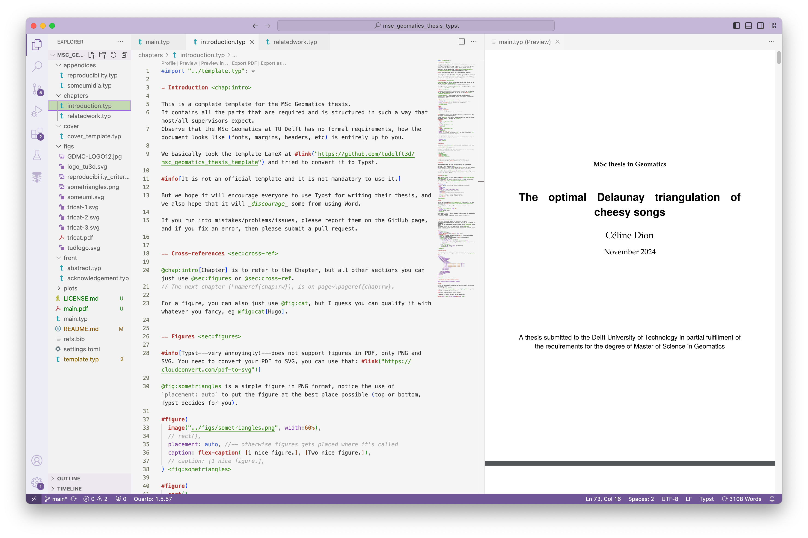

# Typst

Typst is the "new LaTeX": simpler to learn, simpler to modify the layout, about 9423.6X faster.
But also, at the moment, has fewer features, can be a bit buggy, the base code changes often (which can break some functions), etc. 

So great to use, but be warned a bit...

## Typst installation

### Web-application: Typst.app

The [web-application of Typst](https://typst.app/) is free, the rending in real-time works great, and it has collaboration tools integrated. 
The only potential drawback is that not all fonts are present; with a local installation you can use any fonts on your computer.

### Local installation

1. [Follow those instructions for your OS](https://github.com/typst/typst?tab=readme-ov-file#installation)
2. Install [VSCode](https://code.visualstudio.com/)
3. and the [Tinymist extension](https://marketplace.visualstudio.com/items?itemName=myriad-dreamin.tinymist) for it, it offers real-time preview/rendering

## Getting started

!!! external-link "Tutorial Writing in Typst"

    The best is to follow the [official tutorial](https://typst.app/docs/tutorial/writing-in-typst/) to start.

    The only crucial thing missing from it is how to add references, for this we suggest you use "natbib" ([tutorial about bibliography management with natbib](https://www.overleaf.com/learn/latex/Bibliography_management_with_natbib)).

We provide a MSc Geomatics thesis template, where you can find a lot of examples: how to place a figure, pseudo-code, tables, etc.

!!! info "Are you already familiar with LaTeX?"

    If you're used to LaTeX, see the handy [Guide for LaTeX users](https://typst.app/docs/guides/guide-for-latex-users/).

## Managing references

As with LaTeX, BibTeX can be used.
This is a good cross-platform one:

* [JabRef](http://jabref.sourceforge.net) (cross-platform)

### Drawing figures

* [IPE](http://ipe.otfried.org/) (cross-platform; integrates LaTeX text; great for triangulation and geometric stuff)
* Adobe Illustrator (nice, but €€€)
* [Inkscape](https://inkscape.org/en/) (cross-platform)
